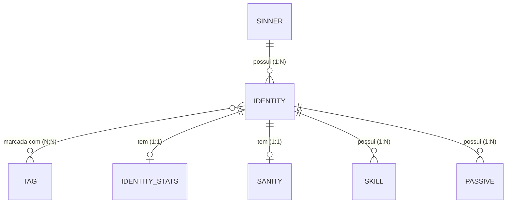

# Limbus-API

API REST estilo wiki da **Limbus Company**, feita com Spring Boot. Cadastra e consulta Sinners, Identities, Tags, Skills, Passivas, Stats e Sanity, com paginação, validação, documentação Swagger e links HATEOAS.

> Projeto da disciplina de Spring Boot (Senac TSI) — **Parte 1**.

## Tecnologias

- Java 21 · Maven · Spring Boot 4.1.1
- Spring Web MVC · Spring Data JPA · Hibernate
- Bean Validation (Jakarta Validation)
- Spring HATEOAS (formato HAL)
- H2 (banco em memória)
- Springdoc OpenAPI / Swagger UI 3.1.1 (com tema customizado)

## Como executar

Requisitos: **JDK 21 ou superior**. O Maven já vem junto no projeto (`mvnw`).

```bash
# Linux / macOS
./mvnw spring-boot:run

# Windows
mvnw.cmd spring-boot:run
```

A API sobe em `http://localhost:8080`.

| Recurso | URL |
| :-- | :-- |
| Swagger UI | http://localhost:8080/swagger-ui/index.html |
| OpenAPI (JSON) | http://localhost:8080/v3/api-docs |
| Console do H2 | http://localhost:8080/h2-console |

Console do H2: JDBC URL `jdbc:h2:mem:limbusdb`, usuário `sa`, senha em branco.

### Coleção do Postman

A coleção está em [`postman/limbus-api.postman_collection.json`](postman/limbus-api.postman_collection.json): **54 requisições** (os 43 endpoints mais 11 casos de erro `400`, `404` e `409`), agrupadas por recurso.

[`Link Site`](https://www.postman.com/kaioalvesesousa-7274103/limbus-api/collection/uorbhg5/limbus-api?action=share&creator=52699429)

1. No Postman: **Import** → selecione o arquivo `.json`.
2. Suba a aplicação (`http://localhost:8080`). A variável `baseUrl` já vem configurada.
3. Rode as pastas de **1 a 8**, de cima para baixo (ou use o **Collection Runner**). Os ids criados são guardados automaticamente em variáveis (`sinnerId`, `identityId`, ...) e cada requisição tem um teste de status.

### Dados iniciais

O H2 é **em memória**: os dados somem ao encerrar a aplicação. Por isso, ao subir, a classe `LoadDatabase` com `app.seed.enable=true` cadastra automaticamente:

- os 12 Sinners;
- as Tags *The House of Spiders*, *The Fingers*, *The Index* e *The Thumb*;
- 1 Identity completa (Rodion), com Stats, Sanity, 4 Skills e 2 Passivas.

Para ligar: mude `app.seed.enabled` de `false` para `true` no `application.properties`.

## Modelo de dados



| Entidade | Descrição |
| :-- | :-- |
| `Sinner` | Um dos 12 personagens jogáveis |
| `Identity` | Versão jogável de um Sinner (raridade, uptie, Tags) |
| `Tag` | Marcador temático de uma Identity |
| `IdentityStats` | HP, velocidade, defesa, Stagger e resistências (1:1 com Identity) |
| `Sanity` | Panic e fatores de Sanity (1:1 com Identity) |
| `Skill` | Ataques e defesa de uma Identity |
| `Passive` | Passivas de combate ou suporte de uma Identity |

Enums: `Rarity` (`ZERO`, `ZERO_ZERO`, `ZERO_ZERO_ZERO`), `SkillSlot`, `Sin`, `PassivaType` (`BATTLE`, `SUPPORT`) e `Resistance` (`INEFFECTIVE`, `NORMAL`, `WEAK`, `FATAL`).

## Convenções da API

### Paginação

Todas as listagens são paginadas e aceitam os mesmos parâmetros de query: `page` (começa em 0), `size` (padrão 10; nos Sinners, 12) e `sort` (ex.: `sort=nome,asc`).

### Links HATEOAS

Cada recurso traz `_links` com `self`, `update` e `delete`, a coleção e os recursos relacionados. As listagens vêm em `PagedModel` (itens em `_embedded`, mais `_links` de navegação e o bloco `page`). Exemplo (formato):

```json
{
  "id": 1,
  "nome": "Yi Sang",
  "_links": {
    "self":       { "href": "http://localhost:8080/sinners/1" },
    "update":     { "href": "http://localhost:8080/sinners/1" },
    "delete":     { "href": "http://localhost:8080/sinners/1" },
    "sinners":    { "href": "http://localhost:8080/sinners" },
    "identities": { "href": "http://localhost:8080/sinners/1/identities" }
  }
}
```

### Erros

Todo erro tem o mesmo corpo:

```json
{
  "status": 404,
  "erro": "Not Found",
  "mensagem": "Sinner não encontrado(a) com id: 99",
  "timestamp": "2026-10-08T00:54:40"
}
```

| Status | Quando |
| :-- | :-- |
| `200 OK` | Consulta ou atualização bem-sucedida |
| `201 Created` | Recurso criado (header `Location` aponta para ele) |
| `204 No Content` | Remoção bem-sucedida |
| `400 Bad Request` | Validação falhou, JSON malformado, id ou enum inválido, parâmetro ausente |
| `404 Not Found` | Recurso (ou Sinner/Identity/Tag referenciado) não existe |
| `409 Conflict` | Valor único duplicado ou recurso ainda em uso |

## API Reference

São **43 endpoints**, em 7 grupos. A descrição completa de cada um (com exemplos de resposta de cada status) está no Swagger UI.

### Sinners

#### Get all sinners

```http
  GET /sinners
```

Lista os Sinners cadastrados, paginado.

| Parameter | Type     | Description                |
| :-------- | :------- | :------------------------- |
| `page` | `integer` | Número da página, começando em 0 (padrão `0`) |
| `size` | `integer` | Itens por página (padrão `12`) |
| `sort` | `string` | Ordenação no formato `campo,asc` ou `campo,desc`, ex.: `sort=nome,asc` |

**Status:** `200` OK

#### Search sinners by name

```http
  GET /sinners/search?nome=${nome}
```

Consulta personalizada por nome.

| Parameter | Type     | Description                |
| :-------- | :------- | :------------------------- |
| `nome` | `string` | **Required**. Texto a procurar dentro do nome (sem diferenciar maiúsculas) |
| `page` | `integer` | Número da página, começando em 0 (padrão `0`) |
| `size` | `integer` | Itens por página (padrão `12`) |
| `sort` | `string` | Ordenação no formato `campo,asc` ou `campo,desc`, ex.: `sort=nome,asc` |

**Status:** `200` OK · `400` Bad Request

#### Get a specific sinner

```http
  GET /sinners/${id}
```

| Parameter | Type     | Description                |
| :-------- | :------- | :------------------------- |
| `id` | `integer` | **Required**. Id do Sinner a buscar |

**Status:** `200` OK · `400` Bad Request · `404` Not Found

#### Create a sinner

```http
  POST /sinners
```

Cria um Sinner.

| Parameter | Type     | Description                |
| :-------- | :------- | :------------------------- |
| `nome` | `string` | **Required**. Nome do Sinner (único, 2 a 100 caracteres, com letras) |

**Status:** `201` Created · `400` Bad Request · `409` Conflict

#### Update a sinner

```http
  PUT /sinners/${id}
```

| Parameter | Type     | Description                |
| :-------- | :------- | :------------------------- |
| `id` | `integer` | **Required**. Id do Sinner a atualizar |
| `nome` | `string` | **Required**. Nome do Sinner (único, 2 a 100 caracteres, com letras) |

**Status:** `200` OK · `400` Bad Request · `404` Not Found · `409` Conflict

#### Delete a sinner

```http
  DELETE /sinners/${id}
```

Só é possível se o Sinner não tiver Identities vinculadas (409).

| Parameter | Type     | Description                |
| :-------- | :------- | :------------------------- |
| `id` | `integer` | **Required**. Id do Sinner a remover |

**Status:** `204` No Content · `400` Bad Request · `404` Not Found · `409` Conflict

### Tags

#### Get all tags

```http
  GET /tags
```

Lista as Tags cadastradas, paginado.

| Parameter | Type     | Description                |
| :-------- | :------- | :------------------------- |
| `page` | `integer` | Número da página, começando em 0 (padrão `0`) |
| `size` | `integer` | Itens por página (padrão `10`) |
| `sort` | `string` | Ordenação no formato `campo,asc` ou `campo,desc`, ex.: `sort=nome,asc` |

**Status:** `200` OK

#### Search tags by name

```http
  GET /tags/search?nome=${nome}
```

Consulta personalizada por nome.

| Parameter | Type     | Description                |
| :-------- | :------- | :------------------------- |
| `nome` | `string` | **Required**. Texto a procurar dentro do nome (sem diferenciar maiúsculas) |
| `page` | `integer` | Número da página, começando em 0 (padrão `0`) |
| `size` | `integer` | Itens por página (padrão `10`) |
| `sort` | `string` | Ordenação no formato `campo,asc` ou `campo,desc`, ex.: `sort=nome,asc` |

**Status:** `200` OK · `400` Bad Request

#### Get a specific tag

```http
  GET /tags/${id}
```

| Parameter | Type     | Description                |
| :-------- | :------- | :------------------------- |
| `id` | `integer` | **Required**. Id da Tag a buscar |

**Status:** `200` OK · `400` Bad Request · `404` Not Found

#### Create a tag

```http
  POST /tags
```

Cria uma Tag.

| Parameter | Type     | Description                |
| :-------- | :------- | :------------------------- |
| `nome` | `string` | **Required**. Nome da Tag (único, 2 a 100 caracteres, com letras) |

**Status:** `201` Created · `400` Bad Request · `409` Conflict

#### Update a tag

```http
  PUT /tags/${id}
```

| Parameter | Type     | Description                |
| :-------- | :------- | :------------------------- |
| `id` | `integer` | **Required**. Id da Tag a atualizar |
| `nome` | `string` | **Required**. Nome da Tag (único, 2 a 100 caracteres, com letras) |

**Status:** `200` OK · `400` Bad Request · `404` Not Found · `409` Conflict

#### Delete a tag

```http
  DELETE /tags/${id}
```

Só é possível se nenhuma Identity usar a Tag (409).

| Parameter | Type     | Description                |
| :-------- | :------- | :------------------------- |
| `id` | `integer` | **Required**. Id da Tag a remover |

**Status:** `204` No Content · `400` Bad Request · `404` Not Found · `409` Conflict

### Identities

#### Get all identities

```http
  GET /identities
```

Lista todas as Identities, com o Sinner dono e as Tags.

| Parameter | Type     | Description                |
| :-------- | :------- | :------------------------- |
| `page` | `integer` | Número da página, começando em 0 (padrão `0`) |
| `size` | `integer` | Itens por página (padrão `10`) |
| `sort` | `string` | Ordenação no formato `campo,asc` ou `campo,desc`, ex.: `sort=nome,asc` |

**Status:** `200` OK

#### Get identities of a sinner

```http
  GET /sinners/${sinnerId}/identities
```

Consulta personalizada: Identities de um Sinner.

| Parameter | Type     | Description                |
| :-------- | :------- | :------------------------- |
| `sinnerId` | `integer` | **Required**. Id do Sinner |
| `page` | `integer` | Número da página, começando em 0 (padrão `0`) |
| `size` | `integer` | Itens por página (padrão `10`) |
| `sort` | `string` | Ordenação no formato `campo,asc` ou `campo,desc`, ex.: `sort=nome,asc` |

**Status:** `200` OK · `400` Bad Request

#### Search identities by tag

```http
  GET /identities/search/by-tag?tag=${tag}
```

Consulta personalizada: Identities que possuem a Tag.

| Parameter | Type     | Description                |
| :-------- | :------- | :------------------------- |
| `tag` | `string` | **Required**. Nome exato da Tag |
| `page` | `integer` | Número da página, começando em 0 (padrão `0`) |
| `size` | `integer` | Itens por página (padrão `10`) |
| `sort` | `string` | Ordenação no formato `campo,asc` ou `campo,desc`, ex.: `sort=nome,asc` |

**Status:** `200` OK · `400` Bad Request

#### Get a specific identity

```http
  GET /identities/${id}
```

| Parameter | Type     | Description                |
| :-------- | :------- | :------------------------- |
| `id` | `integer` | **Required**. Id da Identity a buscar |

**Status:** `200` OK · `400` Bad Request · `404` Not Found

#### Create an identity

```http
  POST /sinners/${sinnerId}/identities
```

O Sinner e as Tags precisam existir antes.

| Parameter | Type     | Description                |
| :-------- | :------- | :------------------------- |
| `sinnerId` | `integer` | **Required**. Id do Sinner dono (na URL) |
| `nome` | `string` | **Required**. Nome da Identity (único, 2 a 100 caracteres, com letras) |
| `uptie` | `integer` | **Required**. Nível de uptie, de 1 a 4 |
| `rarity` | `string` | **Required**. `ZERO` (0), `ZERO_ZERO` (00) ou `ZERO_ZERO_ZERO` (000) |
| `tagIds` | `array<integer>` | **Required**. Ids das Tags da Identity (de 1 a 10; as Tags precisam existir) |

**Status:** `201` Created · `400` Bad Request · `404` Not Found · `409` Conflict

#### Update an identity

```http
  PUT /identities/${id}
```

O Sinner dono não pode ser alterado.

| Parameter | Type     | Description                |
| :-------- | :------- | :------------------------- |
| `id` | `integer` | **Required**. Id da Identity a atualizar |
| `nome` | `string` | **Required**. Nome da Identity (único, 2 a 100 caracteres, com letras) |
| `uptie` | `integer` | **Required**. Nível de uptie, de 1 a 4 |
| `rarity` | `string` | **Required**. `ZERO` (0), `ZERO_ZERO` (00) ou `ZERO_ZERO_ZERO` (000) |
| `tagIds` | `array<integer>` | **Required**. Ids das Tags da Identity (de 1 a 10; as Tags precisam existir) |

**Status:** `200` OK · `400` Bad Request · `404` Not Found · `409` Conflict

#### Delete an identity

```http
  DELETE /identities/${id}
```

Só é possível se a Identity não tiver Skills, Passivas, Stats ou Sanity (409).

| Parameter | Type     | Description                |
| :-------- | :------- | :------------------------- |
| `id` | `integer` | **Required**. Id da Identity a remover |

**Status:** `204` No Content · `400` Bad Request · `404` Not Found · `409` Conflict

### Skills

#### Get all skills

```http
  GET /skills
```

| Parameter | Type     | Description                |
| :-------- | :------- | :------------------------- |
| `page` | `integer` | Número da página, começando em 0 (padrão `0`) |
| `size` | `integer` | Itens por página (padrão `10`) |
| `sort` | `string` | Ordenação no formato `campo,asc` ou `campo,desc`, ex.: `sort=nome,asc` |

**Status:** `200` OK

#### Search skills by sin

```http
  GET /skills/search/by-sin?sin=${sin}
```

Consulta personalizada por pecado.

| Parameter | Type     | Description                |
| :-------- | :------- | :------------------------- |
| `sin` | `string` | **Required**. `WRATH`, `LUST`, `SLOTH`, `GLOOM`, `GLUTTONY`, `ENVY` ou `PRIDE` |
| `page` | `integer` | Número da página, começando em 0 (padrão `0`) |
| `size` | `integer` | Itens por página (padrão `10`) |
| `sort` | `string` | Ordenação no formato `campo,asc` ou `campo,desc`, ex.: `sort=nome,asc` |

**Status:** `200` OK · `400` Bad Request

#### Get a specific skill

```http
  GET /skills/${id}
```

| Parameter | Type     | Description                |
| :-------- | :------- | :------------------------- |
| `id` | `integer` | **Required**. Id da Skill a buscar |

**Status:** `200` OK · `400` Bad Request · `404` Not Found

#### Create a skill

```http
  POST /identities/${identityId}/skills
```

| Parameter | Type     | Description                |
| :-------- | :------- | :------------------------- |
| `identityId` | `integer` | **Required**. Id da Identity dona (na URL) |
| `slot` | `string` | **Required**. `SKILL_1`, `SKILL_2`, `SKILL_3` ou `DEFESA` |
| `variante` | `integer` | **Required**. Número da variante (1 a 10) |
| `sin` | `string` | **Required**. `WRATH`, `LUST`, `SLOTH`, `GLOOM`, `GLUTTONY`, `ENVY` ou `PRIDE` |
| `nome` | `string` | **Required**. Nome da Skill (até 255 caracteres, com letras) |
| `quantidadeCoins` | `integer` | **Required**. Quantidade de moedas (1 a 10) |
| `descricaoEfeito` | `string` | **Required**. Descrição do efeito (até 2000 caracteres) |

**Status:** `201` Created · `400` Bad Request · `404` Not Found

#### Update a skill

```http
  PUT /skills/${id}
```

A Identity dona não pode ser alterada.

| Parameter | Type     | Description                |
| :-------- | :------- | :------------------------- |
| `id` | `integer` | **Required**. Id da Skill a atualizar |
| `slot` | `string` | **Required**. `SKILL_1`, `SKILL_2`, `SKILL_3` ou `DEFESA` |
| `variante` | `integer` | **Required**. Número da variante (1 a 10) |
| `sin` | `string` | **Required**. `WRATH`, `LUST`, `SLOTH`, `GLOOM`, `GLUTTONY`, `ENVY` ou `PRIDE` |
| `nome` | `string` | **Required**. Nome da Skill (até 255 caracteres, com letras) |
| `quantidadeCoins` | `integer` | **Required**. Quantidade de moedas (1 a 10) |
| `descricaoEfeito` | `string` | **Required**. Descrição do efeito (até 2000 caracteres) |

**Status:** `200` OK · `400` Bad Request · `404` Not Found

#### Delete a skill

```http
  DELETE /skills/${id}
```

| Parameter | Type     | Description                |
| :-------- | :------- | :------------------------- |
| `id` | `integer` | **Required**. Id da Skill a remover |

**Status:** `204` No Content · `400` Bad Request · `404` Not Found

### Passives

#### Get all passives

```http
  GET /passives
```

| Parameter | Type     | Description                |
| :-------- | :------- | :------------------------- |
| `page` | `integer` | Número da página, começando em 0 (padrão `0`) |
| `size` | `integer` | Itens por página (padrão `10`) |
| `sort` | `string` | Ordenação no formato `campo,asc` ou `campo,desc`, ex.: `sort=nome,asc` |

**Status:** `200` OK

#### Search passives by type

```http
  GET /passives/search/by-tipo?tipo=${tipo}
```

Consulta personalizada por tipo.

| Parameter | Type     | Description                |
| :-------- | :------- | :------------------------- |
| `tipo` | `string` | **Required**. `BATTLE` ou `SUPPORT` |
| `page` | `integer` | Número da página, começando em 0 (padrão `0`) |
| `size` | `integer` | Itens por página (padrão `10`) |
| `sort` | `string` | Ordenação no formato `campo,asc` ou `campo,desc`, ex.: `sort=nome,asc` |

**Status:** `200` OK · `400` Bad Request

#### Get a specific passive

```http
  GET /passives/${id}
```

| Parameter | Type     | Description                |
| :-------- | :------- | :------------------------- |
| `id` | `integer` | **Required**. Id da Passiva a buscar |

**Status:** `200` OK · `400` Bad Request · `404` Not Found

#### Create a passive

```http
  POST /identities/${identityId}/passives
```

| Parameter | Type     | Description                |
| :-------- | :------- | :------------------------- |
| `identityId` | `integer` | **Required**. Id da Identity dona (na URL) |
| `tipo` | `string` | **Required**. `BATTLE` (combate) ou `SUPPORT` (suporte) |
| `nome` | `string` | **Required**. Nome da Passiva (até 255 caracteres) |
| `descricao` | `string` | **Required**. Descrição (até 2000 caracteres) |

**Status:** `201` Created · `400` Bad Request · `404` Not Found

#### Update a passive

```http
  PUT /passives/${id}
```

A Identity dona não pode ser alterada.

| Parameter | Type     | Description                |
| :-------- | :------- | :------------------------- |
| `id` | `integer` | **Required**. Id da Passiva a atualizar |
| `tipo` | `string` | **Required**. `BATTLE` (combate) ou `SUPPORT` (suporte) |
| `nome` | `string` | **Required**. Nome da Passiva (até 255 caracteres) |
| `descricao` | `string` | **Required**. Descrição (até 2000 caracteres) |

**Status:** `200` OK · `400` Bad Request · `404` Not Found

#### Delete a passive

```http
  DELETE /passives/${id}
```

| Parameter | Type     | Description                |
| :-------- | :------- | :------------------------- |
| `id` | `integer` | **Required**. Id da Passiva a remover |

**Status:** `204` No Content · `400` Bad Request · `404` Not Found

### Sanity

#### Get all sanities

```http
  GET /sanities
```

| Parameter | Type     | Description                |
| :-------- | :------- | :------------------------- |
| `page` | `integer` | Número da página, começando em 0 (padrão `0`) |
| `size` | `integer` | Itens por página (padrão `10`) |
| `sort` | `string` | Ordenação no formato `campo,asc` ou `campo,desc`, ex.: `sort=nome,asc` |

**Status:** `200` OK

#### Get the sanity of an identity

```http
  GET /identities/${identityId}/sanity
```

Consulta personalizada: cada Identity tem no máximo uma Sanity.

| Parameter | Type     | Description                |
| :-------- | :------- | :------------------------- |
| `identityId` | `integer` | **Required**. Id da Identity |

**Status:** `200` OK · `400` Bad Request · `404` Not Found

#### Get a specific sanity

```http
  GET /sanities/${id}
```

| Parameter | Type     | Description                |
| :-------- | :------- | :------------------------- |
| `id` | `integer` | **Required**. Id da Sanity a buscar |

**Status:** `200` OK · `400` Bad Request · `404` Not Found

#### Create a sanity

```http
  POST /identities/${identityId}/sanity
```

Uma Identity só pode ter uma Sanity (409 se já existir).

| Parameter | Type     | Description                |
| :-------- | :------- | :------------------------- |
| `identityId` | `integer` | **Required**. Id da Identity dona (na URL) |
| `panicType` | `string` | **Required**. Descrição do Panic (até 2000 caracteres) |
| `increasingFactors` | `string` | **Required**. O que faz a Sanity subir (até 2000 caracteres) |
| `decreasingFactors` | `string` | **Required**. O que faz a Sanity cair (até 2000 caracteres) |

**Status:** `201` Created · `400` Bad Request · `404` Not Found · `409` Conflict

#### Update a sanity

```http
  PUT /sanities/${id}
```

| Parameter | Type     | Description                |
| :-------- | :------- | :------------------------- |
| `id` | `integer` | **Required**. Id da Sanity a atualizar |
| `panicType` | `string` | **Required**. Descrição do Panic (até 2000 caracteres) |
| `increasingFactors` | `string` | **Required**. O que faz a Sanity subir (até 2000 caracteres) |
| `decreasingFactors` | `string` | **Required**. O que faz a Sanity cair (até 2000 caracteres) |

**Status:** `200` OK · `400` Bad Request · `404` Not Found

#### Delete a sanity

```http
  DELETE /sanities/${id}
```

| Parameter | Type     | Description                |
| :-------- | :------- | :------------------------- |
| `id` | `integer` | **Required**. Id da Sanity a remover |

**Status:** `204` No Content · `400` Bad Request · `404` Not Found

### Identity Stats

#### Get all identity stats

```http
  GET /identity-stats
```

| Parameter | Type     | Description                |
| :-------- | :------- | :------------------------- |
| `page` | `integer` | Número da página, começando em 0 (padrão `0`) |
| `size` | `integer` | Itens por página (padrão `10`) |
| `sort` | `string` | Ordenação no formato `campo,asc` ou `campo,desc`, ex.: `sort=nome,asc` |

**Status:** `200` OK

#### Get the stats of an identity

```http
  GET /identities/${identityId}/stats
```

Consulta personalizada: cada Identity tem no máximo um registro de Stats.

| Parameter | Type     | Description                |
| :-------- | :------- | :------------------------- |
| `identityId` | `integer` | **Required**. Id da Identity |

**Status:** `200` OK · `400` Bad Request · `404` Not Found

#### Get specific identity stats

```http
  GET /identity-stats/${id}
```

| Parameter | Type     | Description                |
| :-------- | :------- | :------------------------- |
| `id` | `integer` | **Required**. Id dos Stats a buscar |

**Status:** `200` OK · `400` Bad Request · `404` Not Found

#### Create identity stats

```http
  POST /identities/${identityId}/stats
```

Uma Identity só pode ter um registro de Stats (409 se já existir).

| Parameter | Type     | Description                |
| :-------- | :------- | :------------------------- |
| `identityId` | `integer` | **Required**. Id da Identity dona (na URL) |
| `hp` | `integer` | **Required**. Pontos de vida (1 a 99999) |
| `speed` | `string` | **Required**. Faixa de velocidade no formato `mín-máx`, ex.: `3-7` (3 a 7 caracteres) |
| `defense` | `integer` | **Required**. Defesa (0 a 9999) |
| `staggerThreshold` | `integer` | **Required**. Limiar de Stagger (1 a 99999) |
| `resistanceSlash` | `string` | **Required**. `INEFFECTIVE` (0.5x), `NORMAL` (1.0x), `WEAK` (1.5x) ou `FATAL` (2.0x) |
| `resistancePierce` | `string` | **Required**. Mesmos valores de `resistanceSlash` |
| `resistanceBlunt` | `string` | **Required**. Mesmos valores de `resistanceSlash` |

**Status:** `201` Created · `400` Bad Request · `404` Not Found · `409` Conflict

#### Update identity stats

```http
  PUT /identity-stats/${id}
```

| Parameter | Type     | Description                |
| :-------- | :------- | :------------------------- |
| `id` | `integer` | **Required**. Id dos Stats a atualizar |
| `hp` | `integer` | **Required**. Pontos de vida (1 a 99999) |
| `speed` | `string` | **Required**. Faixa de velocidade no formato `mín-máx`, ex.: `3-7` (3 a 7 caracteres) |
| `defense` | `integer` | **Required**. Defesa (0 a 9999) |
| `staggerThreshold` | `integer` | **Required**. Limiar de Stagger (1 a 99999) |
| `resistanceSlash` | `string` | **Required**. `INEFFECTIVE` (0.5x), `NORMAL` (1.0x), `WEAK` (1.5x) ou `FATAL` (2.0x) |
| `resistancePierce` | `string` | **Required**. Mesmos valores de `resistanceSlash` |
| `resistanceBlunt` | `string` | **Required**. Mesmos valores de `resistanceSlash` |

**Status:** `200` OK · `400` Bad Request · `404` Not Found

#### Delete identity stats

```http
  DELETE /identity-stats/${id}
```

| Parameter | Type     | Description                |
| :-------- | :------- | :------------------------- |
| `id` | `integer` | **Required**. Id dos Stats a remover |

**Status:** `204` No Content · `400` Bad Request · `404` Not Found

## Termos de Serviço

Esta API é um **projeto acadêmico e de fã (fan project)**, sem fins lucrativos, desenvolvido para a disciplina de Spring Boot (Senac TSI).

- **Propriedade intelectual:** *Limbus Company*, seus personagens (Sinners), Identities, Skills, Passivas, nomes, imagens e demais elementos do jogo pertencem à **Project Moon**. Este projeto **não é afiliado, endossado ou patrocinado** pela Project Moon.
- **Sem uso comercial:** a API existe apenas para fins de estudo e demonstração. Não deve ser usada para obter lucro nem para substituir os serviços oficiais do jogo.
- **Dados:** os dados cadastrados são exemplos e podem estar incompletos ou incorretos. O banco é em memória (H2), então tudo é perdido ao reiniciar a aplicação.
- **Sem garantias:** o serviço é fornecido "como está", sem garantia de disponibilidade, precisão ou adequação a qualquer finalidade. O autor não se responsabiliza por danos decorrentes do uso.
- **Remoção de conteúdo:** se a Project Moon ou qualquer detentor de direitos quiser a remoção de algum conteúdo, basta entrar em contato pelo e-mail abaixo.

## Licença

O **código-fonte** deste projeto é distribuído sob a [MIT License](https://opensource.org/licenses/MIT). A licença cobre apenas o código; os materiais e a propriedade intelectual de *Limbus Company* continuam pertencendo à Project Moon.


## Autor

Kaio Alves — Senac TSI.
